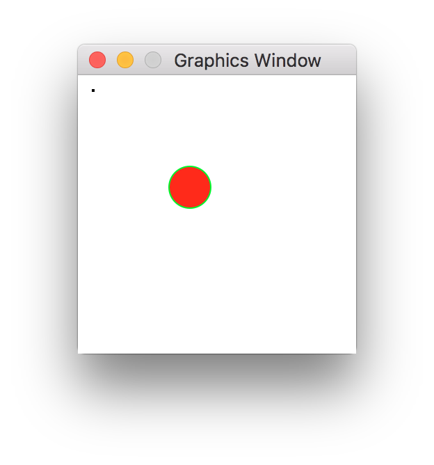
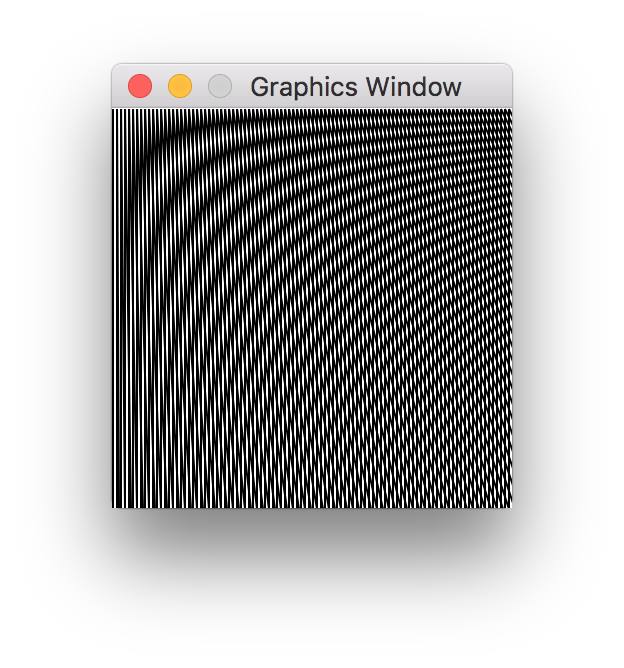
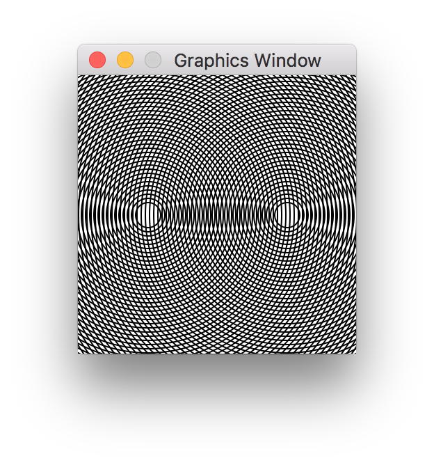
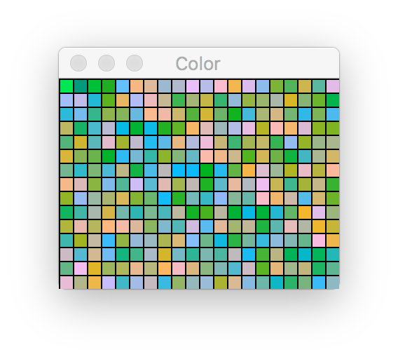
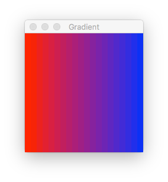
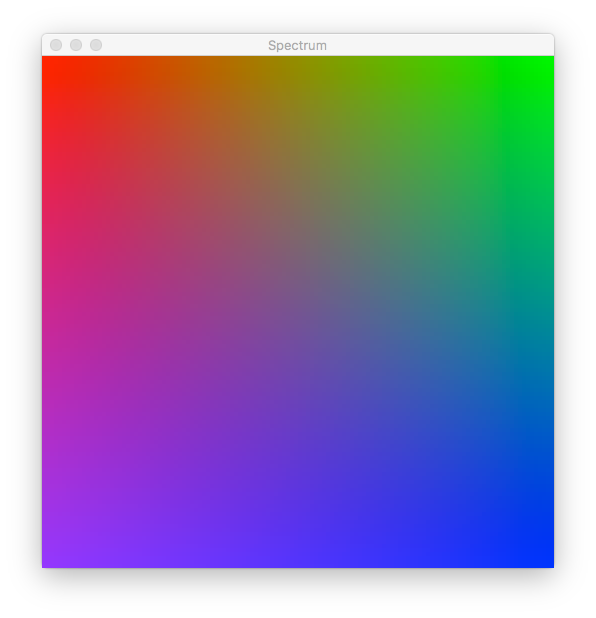
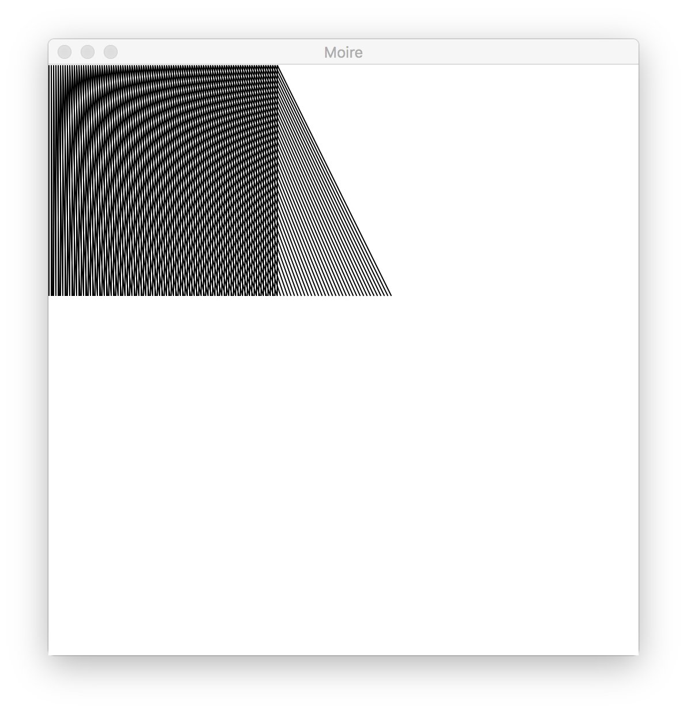
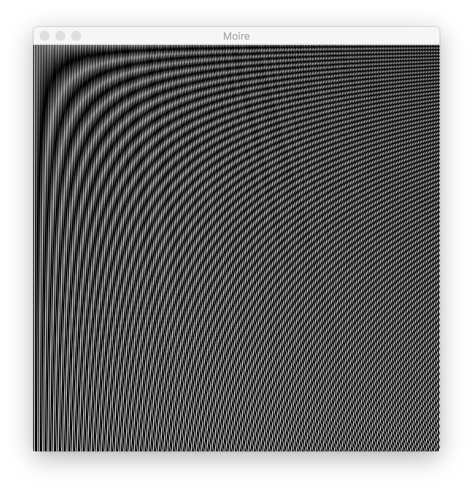

# Python: Turtle Graphics and L-System Tutorial (macOS)

_for Laura Andrea_

&nbsp;

&nbsp;

&nbsp;


### Copyright and License
<a rel="license" href="http://creativecommons.org/licenses/by-nc-sa/4.0/"></a><br />This work is licensed under a <a rel="license" href="http://creativecommons.org/licenses/by-nc-sa/4.0/">Creative Commons Attribution-NonCommercial-ShareAlike 4.0 International License</a>.

&nbsp;


## Introduction

This tutorial intends to teach how to draw simple graphics to the screen for the begining Python programmer. Along the
way, you'll learn some things about operating systems, the UNIX shell, data types, and parsing / string processing. All
of these foundation skills will help even if your primary interest isn't graphics. It is assumed that you already know
the basics of Python, including variables, functions (`def`), loops (`for` and `while`), types (e.g., `string` vs `int`),
and basic data structures (lists, dictionaries, and tuples). You should also understand the difference between
[Python 2 and Python 3](https://wiki.python.org/moin/Python2orPython3) and how to open a terminal. At this time, this
tutorial has a focus on macOS users. (Depending on your savviness, you might get some mileage out of it on another
platform.)

The format of this tutorial is in an immersive learn-as-you-go style. That means we'll explain new concepts as we encounter them. Hopefully that
will enable us to start getting interesting results sooner, but also familiarize you with common patterns. It might be a lot of information at once, in which case I recommend you google whatever is giving you trouble and focus on that in self-study.

> _Side Notes_
>
> Throughout the tutorial, you'll be presented with side notes in this format (as quoted text). These sections are
> optional information or explanations that serve as footnotes.

## Table of Contents

* 1&nbsp;&nbsp;&nbsp;[Project Directory](#dir)
* 2&nbsp;&nbsp;&nbsp;[How to Draw Things](#draw)
	* 2.1&nbsp;&nbsp;&nbsp;[Installing `graphics.py` (and Learning Some Shell)](#install)
	* 2.2&nbsp;&nbsp;&nbsp;[Getting a Small Taste of Drawing](#taste)
* 3&nbsp;&nbsp;&nbsp;[Writing Scripts](#scripts)
	* 3.1&nbsp;&nbsp;&nbsp;[A Simple Program](#simple)
	* 3.2&nbsp;&nbsp;&nbsp;[Moiré Patterns](#moire)
	* 3.3&nbsp;&nbsp;&nbsp;[Working with Color](#color)
		* 3.3.1&nbsp;&nbsp;&nbsp;[RGB Colorspace](#rgb)
		* 3.3.2&nbsp;&nbsp;&nbsp;[Working in Hexdecimal](#hex)
		* 3.3.3&nbsp;&nbsp;&nbsp;[Format Strings](#strings)
		* 3.3.4&nbsp;&nbsp;&nbsp;[Colored Squares](#squares)
		* 3.3.5&nbsp;&nbsp;&nbsp;[Viewing the Spectrum](#spectrum)
* 4&nbsp;&nbsp;&nbsp;[Refactoring](#refactor)
	* 4.1&nbsp;&nbsp;&nbsp;[Revisiting Moiré Lines](#revisit)
	* 4.2&nbsp;&nbsp;&nbsp;[Wrap it in `main()`](#main)
	* 4.3&nbsp;&nbsp;&nbsp;[Functional Decomposition](#func)
	* 4.4&nbsp;&nbsp;&nbsp;[Concepts and Best Practices](#concepts)
	* 4.5&nbsp;&nbsp;&nbsp;[Finishing Touches](#touches)
* 5&nbsp;&nbsp;&nbsp;[Turtle Graphics](#turtle)
	* 5.1&nbsp;&nbsp;&nbsp;[Turtle State](#state)
	* 5.2&nbsp;&nbsp;&nbsp;[Moving the Turtle](#moving)
		* 5.2.1&nbsp;&nbsp;&nbsp;[Calculating a Trajectory](#trajectory)
		* 5.2.2&nbsp;&nbsp;&nbsp;[One Step Forward](#step)
		* 5.2.3&nbsp;&nbsp;&nbsp;[Turning](#turn)
	* 5.3&nbsp;&nbsp;&nbsp;[Using our Turtle to Draw](#using)
	* 5.4&nbsp;&nbsp;&nbsp;[Giving our Turtle Some Class](#class)
		* 5.4.1&nbsp;&nbsp;&nbsp;[Classes](#classdef)
		* 5.4.2&nbsp;&nbsp;&nbsp;[Constructors](#construct)
		* 5.4.3&nbsp;&nbsp;&nbsp;[Instance Variables](#ivars)
		* 5.4.4&nbsp;&nbsp;&nbsp;[Adding Behavior](#methods)
		* 5.4.5&nbsp;&nbsp;&nbsp;[Adding Behavior](#methods)

## <a name="dir"></a>1&nbsp;&nbsp;&nbsp;Project Directory
The first step is to create a working directory in which we will perform all the steps in this tutorial. Let's call this `turtle-tutorial`. For example, we can use the following commands from the terminal.

    $ mkdir ~/turtle-tutorial
    $ cd ~/turtle-tutorial

The `$` is not part of the command you need to type. It is a common prompt for the command shell. Yours may look different.
The character `~` is shorthand for your users home directory on your computer. The home directory is usually the location
you start at after you initially open the terminal.

**Shell Exercises:**
* At the command line, type `echo $SHELL`. This tells you which program you are using as your shell. What shell are you running? 
* The `$` in front of a name is a shell variable, also called an *environment variable*. Like Python, the shell is its own full-fledged programming language. You can see all environment variables by typing `env` at the prompt. Try it now.
* The command `echo` is a way to print something to the screen (just like `print` in python), like we did with the `echo $SHELL` example above. Try the commands `echo $HOME` and `echo ~`. What does this tell you about the `$HOME` environment variable?

> _If shell is like another programming language, why do I have to learn it? I only wanted to learn Python!_
>
> Programming these days relies on a combination of technologies. It's virtually unheard of to get by without knowing
> a little of perhaps a dozen or so programming languages. Although you don't need to become an expert in shell scripting
> it is almost a requirement to know a little to navigate your computer and execute your programs. It is also useful to
> recognize concepts from the shell (and other programming languages) which correspond to things you are learning in
> Python. As you get more experience, you'll see a lot of recurring concepts in different forms in various programming
> languages.

## <a name="draw"></a>2&nbsp;&nbsp;&nbsp;How to Draw Things
Drawing graphics to the screen is a great place to begin learning how to program because the visual feedback is so
rewarding. However, graphics is also often difficult to get started in since the way we draw to screen depends on a number
of factors including what type of computer you're on and your operating system. There is no universal language for drawing.
For this tutorial, we'll use the popular `graphics.py` module which hides a lot of the complexity of computer graphics in
Python.

> _You might ask yourself, if someone can write a module to hide the complexity of graphics, why doesn't everyone just use that?_
>
> The module we're going to use has made a set of compromises in order to be simple. It internally relies on
> a framework called Tcl/Tk to do things like opening the window and providing a canvas context to draw on. If you're
> developing a an application with a user interface, it is unlikely you would want to use Tcl/Tk. Furthermore, while we
> can draw some complex things with our graphics module of choice, it isn't going to be high performance. It would be
> difficult to do complex 3D animations or even a simple game. On the other hand, it is more than sufficient to draw some
> lines, which is all we want to do in these lessons.

### <a name="install"></a>2.1&nbsp;&nbsp;&nbsp;Installing `graphics.py` (and Learning Some Shell)
To get started, we're going to download the graphics module. Make sure you have `wget` installed by typing it in the
shell. You should see output similar to the following:

```
$ wget
wget: missing URL
Usage: wget [OPTION]... [URL]...

Try `wget --help' for more options.
$
```

> _Don't have `wget`?_
>
> If you see an error along the lines of `wget: Command not found.` then you do not have this program installed. On macOS,
> it is easy to install new applications with a package manager called [Homebrew](https://brew.sh/). If you don't have the
> `brew` command (try it just like in the wget example), then go to the [Homebrew](https://brew.sh/) site and type the
> suggested command to install it. After that, type `brew` and you should see example usage. For now, we just need to
> install `wget`. Do so now by typing `brew install wget`.

For the next step, it is important to make sure you are in your tutorial directoy. (`cd ~/turtle-tutorial` if you used the example at the beginning of this tutorial.) Now run wget:

```
$ wget http://mcsp.wartburg.edu/zelle/python/graphics.py
```

This should be quick and you should see several lines of output. This command fetches the link and places it in your
current directory. Let's run some commands to verify that it is there.

```
$ ls
graphics.py
```

The `ls` command lists files in a directory.

```
$ ls -l
total 64
-rw-r--r--@ 1 tmarsh  staff  31552 Aug 26  2016 graphics.py
```

By passing the `-l` (the lowercase letter L, not the number 1) command line option to `ls`, we get the "long" listing. We
won't get into the details here, but just point out that we can see the last modification date of the file (`Aug 26  2016`)
and the size in bytes (`31552`). Let's also see how many lines are in the file. We can use the `wc` command (short for "word count") for this.

```
$ wc -l graphics.py
1015 graphics.py
```

Passing the `-l` option to `wc` tells it to count lines. (This is unrelated to the `-l` we passed to `ls`. It's just a
coincidence that they both take `-l` as an argument.) We can see that this file has 1015 lines of Python code.

**Shell Exercises**:
* `cat` will print the file contents if you give it a filename. Try it now: `cat graphics.py`. You should see a lot of output, 1015 lines in fact.
* Maybe the output was too long to be useful. Try typing `more graphics.py`. You now can interactively page through the file. Type `q` to get out of `more` and `<space>` to page through the file. What do `p` and `b` do?

### <a name="taste"></a>2.2&nbsp;&nbsp;&nbsp;Getting a Small Taste of Drawing

> _Don't like how I explain this section?_
>
> Try [this link](http://anh.cs.luc.edu/python/hands-on/3.1/handsonHtml/graphics.html) instead.

Great, now that we have the graphics module, let's draw something! Let's run python. (Note, you can leave Python at any time by typing `Ctrl`-`d` at the same time.)

```
$ python
Python 2.7.10 (default, Feb  7 2017, 00:08:15)
[GCC 4.2.1 Compatible Apple LLVM 8.0.0 (clang-800.0.34)] on darwin
Type "help", "copyright", "credits" or "license" for more information.
>>>
```
  
> _Compatibility note_
>
> We're running python 2.7. You could also run Python 3, but you may have to adapt some instructions later in the tutorial.

We're going to interactively write some Python code. You will be able to immediately see responses to many of the commands. First, we'll import the graphics module. (As a reminder, you'll need to be in your tutorial directory where you downloaded it.)

```python
>>> from graphics import *
```
 
Now let's create a window.

```python
>>> win = GraphWin()
```

A small window should have just popped up. The window contents should be a white square. Let's inspect `win`.

```python
>>> win
GraphWin('Graphics Window', 200, 200)
```

This is a `GraphWin` object. Conveniently, when we type it's variable name like this, it knows how to report itself with
some details. (Not all objects will do this.) In this case, we should interpret this as a window with title "Graphics
Window", and width and height of 200 pixels.

> _What the heck do you mean by "object"?_
>
> "Objects" and "classes" are a topic of their own. We'll need a working definition since we'll be using these terms a
> lot. An "object" can be thought of as roughly analogous to real world objects, like your coffee mug, or your computer.
> Of course, the objects in our program our much more abstract things than that.
>
> You've already used objects if you've used strings or lists. One characteristic of an object is that it has methods that
> you can call on it. (A method is like a function but it is attached to an object.) For example if you have a string
> `s = "test string"`, you can call the `split` method on it like so: `s.split()` and it will be broken into a list with
> two strings.
>
> So what is a "class". This is the category or type of an object. (Although "type" has an additional meaning in Python,
> so we'll try to avoid saying that too much.) As a physical analogy, if your personal coffee mug is an object, then it
> might be a representative of the `CoffeeMug` class, the sort of ur-type of all coffee mugs, or alternately the template
> for all such mugs. Your personal coffee mug is just an instance of this class. In fact, we use the term "instance"
> interchangeably with the term "object" when referring to them.

Let's try drawing something in this window.

```python
>>> p = Point(10, 10)
>>> p.draw(win)
```

We created an instance of the class `Point` and assigned the instance to the variable `p`. Then we called the `draw` method
of the point object, passing it the argument `win`. There should now be a black pixel at the position (10, 10) on the 
window. You drew something! I hope it was worth it to get this far. This pixel is a major milestone for you.

What else can we do? Well, there are a couple of ways to inspect the graphics module we're using that will give us some
hints. One way would be to read the contents of `graphics.py`. If you're not an experience Python programmer, that might
be a little overwhelming. Instead, we'll use the `dir()` function in Python.

```python
>>> dir()
['BAD_OPTION', 'Circle', 'DEFAULT_CONFIG', 'Entry', 'GraphWin', 'GraphicsError',
 'GraphicsObject', 'Image', 'Line', 'OBJ_ALREADY_DRAWN', 'Oval', 'Point', 'Polyg
on', 'Rectangle', 'Text', 'Transform', 'UNSUPPORTED_METHOD', '__builtins__', '__
doc__', '__name__', '__package__', 'color_rgb', 'os', 'p', 'sys', 'test', 'time'
, 'tk', 'update', 'win']
```

We got a list of strings. If you look closely, you'll see that `'p'` and `'win'` are in that list. Those refer to the
variables we just created. Looking at the list, there's a lot we don't know about yet, but some things are obvious:
`Line`, `Oval`, `Point`, `Rectangle`, and a few others are likely candidates to be other things we can draw. We'll try one
now.

```python
>>> c = Circle(Point(100, 100), 15)
>>> c.draw(win)
```

You should now see a circle on your window. As you can see, to draw a circle, we have to create a `Circle` object
using  `Point` objects (which takes and `x` and `y` coordinate), and a radius in pixels. Calling the `draw` method causes
the circle to appear on the screen.

We can also modify objects once they have been drawn. (Note, this is actually pretty unusual for graphics drawing
libraries, but useful for interactive drawing.) First lets see what our circle contains using the `dir` function.

```python
>>> dir(c)
['__doc__', '__init__', '__module__', '__repr__', '_draw', '_move', '_reconfig',
 'canvas', 'clone', 'config', 'draw', 'getCenter', 'getP1', 'getP2', 'getRadius'
, 'id', 'move', 'p1', 'p2', 'radius', 'setFill', 'setOutline', 'setWidth', 'undr
aw']
```

Again, we don't need to understand everything here, but we can see some candidates. It looks like some of these are
methods, like `draw` which we already used. Unfortunately, using `dir()`, we don't see what arguments a method requires.
For that you'll need to find the method in the [documentation](http://mcsp.wartburg.edu/zelle/python/graphics/graphics/index.html) or look through the source of `graphics.py`.

We'll try a few simple operations on our circle. As you type each of these in, be sure to watch the reaction in the
graphics window.

```python
>>> c.setFill('red')
>>> c.setOutline('green')
>>> c.move(-20, -20)
```

Congratulations! You've taken your first steps in rendering graphics interactively in Python.

**Python Exercises:**
* Using the [`graphics.py` documentation](http://mcsp.wartburg.edu/zelle/python/graphics/graphics/index.html), can you draw a line on the screen? What about several lines?
* Using `dir`, inspect some of the objects. For example, `dir()` shows us that `c` is a globally available variable. Calling `dir(c)` inspects only the contents of c. That shows, for example, that `move` is contained within `c`. Explore a few more names. Something that is within `c` can be accessed using the `.` operator. For example, `c.move`. Try `dir(c.p1)` and `c.config` by typing them (without parenthesis) at the Python prompt.
* _Advanced_: learn more about classes and objects in Python at [this tutorial](https://jeffknupp.com/blog/2014/06/18/improve-your-python-python-classes-and-object-oriented-programming/)

## <a name="scripts"></a>3&nbsp;&nbsp;&nbsp;Writing Scripts

Running commands interactively at the Python prompt is a useful way to experiment. However, you lose your work when you
leave the the Python prompt and it is difficult to do anything more than some simple commands. From now on we are going
to do all of our work in a Python scripts that we will save.

### <a name="simple"></a>3.1&nbsp;&nbsp;&nbsp;A Simple Program

Within the tutorial directory, let's create a file with the following contents, naming the file `draw.py`. Make sure to save it in your tutorial directory.

```python
#!/usr/bin/env python

from graphics import *

# Open the window
win = GraphWin()

# Create and draw a point
p = Point(10, 10)
p.draw(win)

# Create and draw a circle
c = Circle(Point(100, 100), 15)
c.draw(win)

# Manipulate our circle
c.setFill('red')
c.setOutline('green')
c.move(-20, -20)
```

Now let's run this script.

```
$ python ./draw.py
```

What happened? Did you see the window pop up? If not, try running it again and keep a close eye. You should see the window
briefly appear on screen. Think a bit about why it might be disappearing.

You may have guessed correctly that the program exits when it reaches the end of your script. When it ends, it takes the
window with it. We're going to add the following code to the end of the script now:

```python
# Wait for a mouse click
win.getMouse()

# Close the window
win.close()
```

The last line to invoke `close()` method is not strictly necessary, but it is good housekeeping to clean up after ourselves
in an orderly fashion. Such habits will pay off when building more complex programs.


Now run the script again, after saving your changes to the file. You should see a window that matches the following:



This time the window should stay on screen. When you click inside the window, you'll see that the program exits.

> _What does `#!/usr/bin/env python` mean?_
>
> This is what is referred to as the "[shebang](https://en.wikipedia.org/wiki/Shebang_(Unix))". It tells the program loader
> what program to execute when you invoke this script directly. Up until now you've been invoking the `python` program
> directly by typing `python ./draw.py` at the prompt. However, it is possible, with some additional work to invoke the
> script directly.
> 
> First, type `chmod +x ./draw.py`. `chmod` changes the flags of a file on disk and `+x` tells it that the file should be directly executable. Now, instead of typing `python ./draw.py`, you can simply type `./draw.py` and the program should run.
>
> As to the shebang, we can break it down. The `#` is just a comment in python. However, when followed by an exclamation
> mark (`#!`) on the first line, it has special meaning indicating that it is a shebang. Everything after the exclamation
> mark is a path to an executable and subsequent arguments. So the executable we are invoking is actually `/usr/bin/env`. `env`
> is used to set environment variables and execute programs. Typing `env python` will run python wherever it happens to
> be installed. Since the shebang needs a fully qualified path (that is, a path starting from the root of your file system
> to the file), it must match exactly. Since `python` could be installed anywhere, we can't simply have `#!/usr/bin/python`. It
> might actually be in `/usr/bin/python`, `/usr/local/bin/python`, or any number of locations. `env`, on the other hand, is guaranteed to always be in `/bin` because it is a standard part of systems. Python is a relative newcomer to the computing field. To find out where your `python` executable located
> you can use `which`, like this: `which python`. Let's say that it returned `/usr/bin/python`. You can list that directory
> with `ls` like so: `ls /usr/bin`. You will see that there are a _lot_ of binaries there. The `$PATH` environment variable
> and `env` work together to successfully launch your python script regardless of where your Python executable is
> installed.

**Python Exercises:**
* Copy `draw.py` to a new file called `draw-loop.py` using the `cp` command: `cp draw.py loop.py`. Type `ls -l` to verify that the directory contains what you expect. In `draw-loop.py`, find the lines that create a circle. Modify this to be a a loop which creates 4 circles.

### <a name="moire"></a>3.2&nbsp;&nbsp;&nbsp;Moiré Patterns

Let's play around with some of our new tools. Create a new Python script filed in your tutorial directory called `moire.py`
with the following contents:

```python
#!/usr/bin/env python

from graphics import *

# Open the window
win = GraphWin()

for x in range(0, 200, 2):
    line = Line(Point(x, 0), Point(x, 200))
    line.draw(win)

for x in range(0, 200, 2):
    line = Line(Point(x, 0), Point(x+(x/2), 200))
    line.draw(win)

win.getMouse()
win.close()
```

Now run it and you should see some lines drawn in two passes. You should see an image generated that matches the following.



The first pass creates some vertical lines, and the second
pass creates the same number of lines but with their one of their x coordinates offset by a variable amount. The result
is what is called the _[moiré pattern](https://en.wikipedia.org/wiki/Moir%C3%A9_pattern)_. You can also create moiré
patterns with other regular shapes, like circles:

```python
#!/usr/bin/env python

from graphics import *

# Open the window
win = GraphWin()

for p in [Point(50, 100), Point(150, 100)]:
    for r in range(9, 180, 3):
        c = Circle(p, r)
        c.draw(win)

win.getMouse()
win.close()
```

This results in another pattern being generated:



There are two loops here, so you might want to think about what this program is doing. If you're unsure, you might add
some `print` statements to help see what's going on. Since the output can go by a little quickly, we're also going
to ask it to pause. First, we're going to import an additional module named `time`. Near the line that imports `graphics`
we'll add a line to `import time`. Then we'll add some `print` and `time.sleep()` calls to help us out.

```python
#!/usr/bin/env python

from graphics import *
import time                 # Added import

# Open the window
win = GraphWin()

for p in [Point(50, 100), Point(150, 100)]:
    for r in range(9, 180, 3):
        c = Circle(p, r)
        c.draw(win)
        print c             # Added print statement
        time.sleep(1)       # Added time.sleep()

win.getMouse()
win.close()
```

We've added some comments where changed the file. Now if you run the program you should see that it runs _really_ slowly.
(Type `Ctrl`-`c` at the same time to interrupt it.) Additionally, it is printing on the console information about what it
is doing:

```
$ python ./moire-circle.py
Circle(Point(50.0, 100.0), 9)
Circle(Point(50.0, 100.0), 12)
Circle(Point(50.0, 100.0), 15)
^CTraceback (most recent call last):
  File "moire-circle.py", line 14, in <module>
    time.sleep(1)
KeyboardInterrupt
```

Now we can see exactly what it is drawing and by when by watching the console output and drawing at the same time. In this
case we can see that we're drawing continually at `(50, 100)`, with ever increasing radius. If you watch long enough,
you'll see that eventually we start drawing circles at the second point, `(150, 100)` when we have finished drawing up
to radius `180` at the first location. If some of this is still unclear, try modifying the script to change the behavior.
With some experimentation it should become clear. Use `print` and `time.sleep()` to help you.

Note that `time.sleep()` takes the number of seconds as its argument. By passing `1`, we're asking it to wait for 1 second
before proceeding to execute the next line. You can vary this and even include fractional amounts. For example, you can
pass `0.5` to sleep for only half a second.

You may, at this point, be a little frustrated with the miniature window we've been using. If you want, you can pass
arguments during the creation of the `GraphWin`. You can give the window a different title and make it a custom size,
for example. Here is an example of creating a larger window with a custom title.

```python
win = GraphWin("My Window", 640, 480)
```

Try replacing the equivalent line in this script and verify that you get a larger window. What do you notice about the drawing relative to the window size?

**Python Exercises:**
* Experiment more with looping and lines. We made a moiré with two passes of drawing lines. Can you find a result you like by doing three passes of lines?
* Try making the window 512 x 512 pixels. Modify one of the moiré examples so that it completely fills the screen. This is easiest with the lines example, `moire.py`.
* Use variables to store the screen size. Call them `max_x` and `max_y`, for example, respectively for the width and the height of the window. Modify your moiré code so that it uses these variables so that it always covers the whole screen regardless of what `max_x` and `max_y` values you use. Again, this is easiest with the lines example, `moire.py`. However, for a more advanced geometry challenge, you could try this for circle examples too.
* Modify the lines example so that it only uses one loop instead of two.

### <a name="color"></a>3.3&nbsp;&nbsp;&nbsp;Working with Color

Aside from our first steps, we've just been drawing black and white lines and circles. Since we won't be doing anything colorful for a little while, let's learn the basics of coloring now.

#### <a name="rgb"></a>3.3.1&nbsp;&nbsp;&nbsp;RGB Colorspace
You've already seen some use of color, like this following snippet from the beginning of the tutorial.

```python
# Create and draw a circle
c = Circle(Point(100, 100), 15)
c.draw(win)

# Manipulate our circle
c.setFill('red')
c.setOutline('green')
c.move(-20, -20)
```

We use `setFill` on the circle instance to tell it to color the circle red. Here we just write the string `'red'`. `graphics.py` only has a limited vocabulary when it comes to colors. If we want to express colors outside its small set or if we want to choose colors programmatically, we have to take a different approach.

Colors can also be expressed by the red/green/blue (RGB) components, or "channels". There are two common ways to represent a color in the RGB color space. Sometimes each component is as percentages, a number between 0 and 1. For example, pure red could be represented by the value `(1.0, 0.0, 0.0)`. Similarly, aquamarine would be represented as (0.5, 1.0, 0.83). More common is to represent the components as integers in the range 0-255. This means it is an 8-bit color channel since it has the range of an 8-bit integer. Using this convention, aquamarine would be (172, 255, 212). Both conventions are used widely, but `graphics.py` uses 8-bit color channels.

> _How many colors can we represent with 8-bit components?_
>
> If the color components range from 0-255, we know that each component is 8-bit. We say the overall "color depth" is then 24-bit (= 8 * 3). That can represent 2<sup>24</sup> colors which is 16,777,216 distinct colors. (The human eye can differentiate perceive roughly 10 million colors at a time.)
>
> 24-bit color is referred to as "True color", which is a marketing term to distinguish itself from the earlier "Hi-color" (15/16-bit color depth) and 8-bit color (which could only display 256 total colors on screen at a time). Higher color-depths are also available, known as "deep color". Deep color is 30-, 36-, or 48-bit, providing a billion or more colors. Special hardware is required to operate at these color depths.

#### <a name="hex"></a>3.3.2&nbsp;&nbsp;&nbsp;Working in Hexdecimal

Although colors are specified in 8-bit channels in `graphics.py`, we actually have to tell `setFill` and other functions in a special format. The format is string that has the form `'#RRGGBB'`, where RR, GG, and BB are the two digit _hexadecimal_ representation of the number. In that rendering, `0` is `'00'` and 255 is `'FF'`. The color white is `'#FFFFFF'`, and black is `'#000000'`, while aquamarine would be `'#7FFFD4'`.

For simplicity and consistency, we'll say that the length should always be 7 (the `#` plus six hex digits). However, in case you ever run across it, be aware that three-digit color codes are also supported. (`'#123'` is the same as `'#112233'`, `'#FFF'` is the same as `'#FFFFFF'`, etc.)

Note that you don't have to use upper-case for the hexadecimal digits. Both work fine, and `'#7fffd4'` is equivalent to `'#7FFFD4'`. (Lower-case seems to be more popular nowadays.)

We can try this out interactively by setting the window background to a specific color.

```python
>>> from graphics import *
>>> win = GraphWin()
>>> win.setBackground('#7fffd4')
```

In Python, you can use hexadecimal literals directly in programs, but you have to prefix them with `0x`.

```python
>>> 0x7F
127
>>> 0xFF
255
>>> 0xD4
212
```

This doesn't help us make a string in hex format, though:

```python
>>> str(0x7F)
'127'
```

It's value is still 127. Python just lets us enter numbers in our program in a base that is convenient.

> _How does the `0x` prefix work?_
>
> Python, and several other programming languages accept numbers in several bases. In Python's case, you denote a different base by typing a `0` followed by a letter (in this case `x`) to denote the base, followed by the number itself. So `x` means "hexadecimal" in this syntax.
>
> Other bases are supported too, including octal (base 8, e.g., `0o1234567`) and binary (base 2, e.g., `0b1010101`).

#### <a name="strings"></a>3.3.3&nbsp;&nbsp;&nbsp;Format Strings

The goal is to generate a string representation of our number in hexadecimal format. There is a concise way to do that built into the string object. Using the `format` method in conjunction with a special placeholder in a string will insert a value.

```python
>>> '{}'.format(123)
'123'
```

(This is equivalent to doing `str(123)`, however `str` only knows how to create a decimal representation.)

We can pass multiple options to be interpolated into the string, and they can be almost any type.

```python
>>> 'First option: {}, second option: {}'.format(123, 'abc')
'First option: 123, second option: abc'
```

An optional index let's you specify which argument should appear where, and it may appear multiple times.

```python
>>> 'First option: {0}, second option: {1}, first option again: {0}'.format(123, 'abc')
'First option: 123, second option: abc, first option again: 123'
```

Strings using these special placeholders are call "format strings. They are essentially a mini-language of their own and can be quite daunting to the beginner. The placeholders are called "replacement fields".

We want to use a feature of format strings to provide a "format specification" for one of our arguments. Let's take an example:

```python
>>> '{:x}'.format(127)
'7f'
```

There's our hexadecimal number! The format specifier is `x`, which means we wanted our argument to be represented in hexadecimal. The `:` indicates the beginning of a format specified.

It would appear the format string for the RGB color will look like `#{:x}{:x}{:x}`. Let's try it with aquamarine.

```python
>>> '#{:x}{:x}{:x}'.format(0x7F, 0xFF, 0xDF)
'#7fffdf'
```

Success! Now lets try another color like brown, for which we'll aim for `'#663300'`.

```python
>>> '#{:x}{:x}{:x}'.format(0x66, 0x33, 0x00)
'#66330'
>>> '{:x}'.format(0x00)
'0'
>>> '{:x}'.format(0x0a)
'a'
>>> '{:x}'.format(0x10)
'10'
```

There's a problem. We only got one of our zeros. The issue is that we'll only get one digit unless the representation is more than one digit. What we desire is to prefix the number with a `0` in case it is less than `0x10`. Fortunately, we can use an additional feature of the format specifier to do this. Our format specifier is now `:02x`.

```python
>>> '{:02x}'.format(0x00)
'00'
>>> '{:02x}'.format(0x0a)
'0a'
>>> '{:02x}'.format(0x10)
'10'
>>> '#{:02x}{:02x}{:02x}'.format(0x66, 0x33, 0x00)
'#663300'
```

A lot more can be done with format strings - it's a large topic. It's highly recommended to read the [format string syntax](https://docs.python.org/2/library/string.html#formatstrings) if you're doing anything complicated.

**Python Exercises:**
* Experiment with format strings. Can you generate binary and octal representations of numbers?

#### <a name="squares"></a>3.3.4&nbsp;&nbsp;&nbsp;Colored Squares

With all the tools necessary, it's time to pull things together. We can define a function which will take the color channels. We will write a function that takes RGB channels as integers and returns a color string.

```python
def rgb_to_color(r, g, b):
    return '#{:02x}{:02x}{:02x}'.format(r, g, b)
```

What happens if any of the channels are less than or greater to zero? This might happen if we have an error elsewhere in our code. This is an opportune time to validate that the numbers we receive are within the expected range. We can test if a number `n` is in a range by asking if `0 <= n`  and `n <= 255`. Or put together, `0 <= n <= 255`.

The `assert` function will force our program to crash if it is passed `False` (and will do nothing if it is passed `True`). It is a first line of defense when writing code which makes certain assumptions, like we do about the range of numbers. For example:

```python
>>> assert(0 <= 37 <= 255)
>>> assert(0 <= 256 <= 255)
Traceback (most recent call last):
  File "<stdin>", line 1, in <module>
AssertionError
```

We'll modify our function to use this:

```python
def rgb_to_color(r, g, b):
    # Test that all numbers are in range
    for n in [r, g, b]:
        assert(0 <= n <= 255)

    # Build color string
    return '#{:02x}{:02x}{:02x}'.format(r, g, b)
```

Now we use all these tools, and our existing knowledge of `graphics.py` to create an image with color. Place the following contents in a new file in your tutorial directory and call it `squares.py`.

```python
#!/usr/bin/env python

from graphics import *

def rgb_to_color(r, g, b):
    # Test that all numbers are in range
    for n in [r, g, b]:
        assert(0 <= n <= 256)

    # Build and return a color string
    return '#{:02x}{:02x}{:02x}'.format(r, g, b)

# Set up window
win = GraphWin("Color", 200, 150)
win.setBackground('black')

# We choose a random starting color set
(r, g, b) = (1, 234, 56)

# For each row
for y in range(0, 150, 10):

    # For each column
    for x in range(0, 200, 10):

        # Compute the RGB color string and draw the square
        color = rgb_to_color(r, g, b)

        # Construct a Rectangle object
        s = Rectangle(Point(x, y), Point(x+10, y+10))

        # Set the fill color. Note that the outline color will be black
        # unless changed here too, using `setOutline`
        s.setFill(color)

        # Draw our object on-screen
        s.draw(win)

        # Cycle the colors
        r = (r * 2 + r) % 256
        g = (g / 2 - g) % 256
        b = (r * g - b) % 256

win.getMouse()
win.close()
```

This program cycles through some pleasant colors generating a series of colored squares. The result should match the following.



**Python Exercises:**
* Modify the example to color the square according to different rules.
* See if you can apply interesting coloring rules to the moiré pattern examples we tried earlier.

#### <a name="spectrum"></a>3.3.5&nbsp;&nbsp;&nbsp;Viewing the Spectrum

Now for some algorithm fun, with the goal of visualizing the color spectrum. We won't be learning any new Python-specific skills here. This section is focused purely on general programming.

Let's start with a simple goal of drawing a gradient, a smooth blend, from one color to another. Where to start? It is often helpful to start with a simple example. Let's say we're drawing a gradient from red (`(255, 0, 0)`) to blue (`(0, 0, 255)`). Our midpoint will be purple (`(127, 0, 127)`).

Let's draw our gradient from left to right, so we'll have red on the left and blue on the right. We'll draw it as a series of tall, skinny rectangles of varying color. At the left, we'll be 100% red and 0% blue. The inverse will hold true at the right, and at the midpoint we'll be 50%/50%. So, this translates to a fairly straightforward way to apply our gradient. For a given color, and a percentage amount (`0.0` to `1.0`) we can scale the amount of the contribution from the two sides. For our example, we will set the left-hand of the window as the 0% side and the right as the 100% side.

This will hopefully become clearer with some code. We'll call the progress from left to right `t`. For a test, we'll just use numbers instead of the RGB triples.

```python
>>> t = 0.0
>>> a = 10.0
>>> b = 20.0
```

When `t` is 0, we want the contribution from `b` to be 0%. That's easy, we can just multiply `b` times `t`. That also covers the contribution from `b` in the case that `t` is 100% too (`1.0 * b == b`). So we now know that term. The term for the contribution from `a` is actually just `1.0 - t`. Let's try this for various amounts.


```python
>>> t = 0.0
>>> ((1-t)*a, t*b)
>>> (10.0, 0.0)
```

That's correct 100% for `a` and 0% for `b`. The inverse case works too.

```python
>>> t = 1.0
>>> ((1-t)*a, t*b)
>>> (0.0, 20.0)
```

And finally, the midpoint at 50%:

```python
>>> t = 0.5
>>> ((1-t)*a, t*b)
>>> (5.0, 10.0)
```

If we add these up, that is `15`, exactly the midpoint between our `a` and `b`.

This is referred to as [linear interpolation](https://en.wikipedia.org/wiki/Linear_interpolation), and commonly shortened to "lerp" in computing. We can trivially define a lerp function in Python.

```python
>>> def lerp(a, b, t):
...     return (1-t)*a + t*b
...
>>> lerp(10.0, 20.0, 0.0)
10.0
>>> lerp(10.0, 20.0, 1.0)
20.0
>>> lerp(10.0, 20.0, 0.5)
15.0
```

For our gradient, we want to lerp between RGB values. So we'll use this `lerp` function function to build a way to interpolate between two colors:

```python
def lerp(a, b, t):
    return (1-t)*a + t*b

def lerp_rgb(ca, cb, t):
    return (int(lerp(ca[0], cb[0], t)),
            int(lerp(ca[1], cb[1], t)),
            int(lerp(ca[2], cb[2], t)))
```

Let's try these out.

```python
>>> lerp_rgb(start, end, 0)
(255, 0, 0)
>>> lerp_rgb(start, end, 1)
(0, 0, 255)
>>> lerp_rgb(start, end, 0.5)
(127, 0, 127)
```

Place the following code in to a file called `gradient.py` in your tutorial directory.

```python
#!/usr/bin/env python

from graphics import *

def lerp(a, b, t):
    return (1-t)*a + t*b

def lerp_rgb(ca, cb, t):
    return (int(lerp(ca[0], cb[0], t)),
            int(lerp(ca[1], cb[1], t)),
            int(lerp(ca[2], cb[2], t)))

def rgb_to_color(r, g, b):
    return '#{:02x}{:02x}{:02x}'.format(r, g, b)

start = (255, 0, 0)
end = (0, 0, 255)

win = GraphWin("Gradient", 200, 200)
for x in range(0, 200, 10):
    rect = Rectangle(Point(x, 0), Point(x+10, 200))

    # Our `t` is equal to the percentage of the screen we've processed
    (r, g, b) = lerp_rgb(start, end, x/float(200))
    color = rgb_to_color(r, g, b)
    rect.setFill(color)
    rect.setOutline(color)

    rect.draw(win)

win.getMouse()
win.close()
```

Run it and you should see the following result.



To draw the spectrum, we're going to extend the interpolation to two dimensions. This is referred to as [bilinear interpolation](https://en.wikipedia.org/wiki/Bilinear_interpolation). The code looks a lot more complicated, but most of that is due to our inability to express things like adding two RGB triples or multiplying a scalar against an RGB triple. With a linear algebra library these functions would look much simpler and more intuitive, and the equivalent linear algebra code is included in the comments. Place the following code in a file called `spectrum.py` in your tutorial directory.


```python
#!/usr/bin/env/python

from graphics import *

# Multiply t against all elements
def rgb_multiply(t, (r, g, b)):
    return (t*r, t*g, t*b)


# Add two RGB vectors element-wise
def rgb_add(c1, c2):
    return (c1[0] + c2[0],
            c1[1] + c2[1],
            c1[2] + c2[2])

# Lerp in two dimensions.
def bilinear(tx, ty, c00, c10, c01, c11):
    # With a linear algebra package this would just be:
    #
    #     a = (1-tx)*c00 + tx*c10;
    #     b = (1-tx)*c01 + tx*c11;
    #     return (1-ty)*a + ty*b

    a = rgb_add(rgb_multiply(1-tx, c00),
                rgb_multiply(tx,   c10))

    b = rgb_add(rgb_multiply(1-tx, c01),
                rgb_multiply(tx,   c11))

    return rgb_add(rgb_multiply(1-ty, a),
                   rgb_multiply(ty, b))


def rgb_to_color(r, g, b):
    return '#{:02x}{:02x}{:02x}'.format(r, g, b)

def spectrum(tx, ty):
    # The colors that dominate each quadrant
    c00 = (255, 0,   0)   # Red     - Top left
    c10 = (0,   255, 0)   # Green   - Top right
    c01 = (128, 0,   255) # Violet  - Bottom left
    c11 = (0,   0,   255) # Blue    - Bottom right

    (r, g, b) = bilinear(tx, ty, c00, c10, c01, c11)

    # We need to convert the values back to ints
    return (int(r), int(g), int(b))

size = 4
width, height = (512, 512)

# NOTE: we turn off flushing (last param False) so that we can
# draw this screen in a reasonable amount of time.
win = GraphWin("Spectrum", width, height, False)

for y in range(0, height, size):
    ty = y/float(height)

    for x in range(0, width, size):
        tx = x/float(width)

        # Find curent color
        (r, g, b) = spectrum(tx, ty)
        color = rgb_to_color(r, g, b)

        square = Rectangle(Point(x, y), Point(x+size, y+size))
        square.setFill(color)
        square.setOutline(color)
        square.draw(win)

win.getMouse()
win.close()
```

You should be rewarded with an image like the following.




For our spectrum, we choose to put red in the top-left corner, green in the top-right corner, blue in the bottom-left corner, and violet in the bottom left.

> _Why include violet?_
>
> For one thing, we have only three dimensions of color and we're trying to interpolate them across four dimensions. So we must pick some color. However, violet is useful for a specific reason.
>
> RGB is a convenient model for color for computing, but it's not representative of how humans perceive color. The different types of cones in our eyes are sensitive to different color wavelengths, and it turns out that we are more sensitive to green. By choosing violet, we are supporting the blue and red ends of the spectrum in our program, and de-emphasizing green. Since green is so dominant, you cannot tell that it is being diminished.

For fun, we can also play around with other blending models. Try this example program, pasting it into a script called `blend.py` in your tutorial directory.

```python
#!/usr/bin/env python

from graphics import *

def lerp(a, b, t):
    return (1-t)*a + t*b

def lerp_rgb(ca, cb, t):
    return (int(lerp(ca[0], cb[0], t)),
            int(lerp(ca[1], cb[1], t)),
            int(lerp(ca[2], cb[2], t)))

def blend(tx, ty):
    a = (255, 0,   0)   # Red
    b = (0,   255, 0)   # Green
    c = (255, 255, 0)   # Yellow
    d = (0,   0,   255) # Blue

    color_t = lerp_rgb(a, b, tx)
    color_u = lerp_rgb(c, d, ty)
    return lerp_rgb(color_t, color_u, 0.5)

def rgb_to_color(r, g, b):
    return '#{:02x}{:02x}{:02x}'.format(r, g, b)

size = 4
width, height = (512, 512)

# NOTE: we turn off flushing (last param False) so that we can
# draw this screen in a reasonable amount of time.
win = GraphWin("Spectrum", width, height, False)

for y in range(0, height, size):
    ty = y/float(height)

    for x in range(0, width, size):
        tx = x/float(width)

        # Find curent color
        (r, g, b) = blend(tx, ty)
        color = rgb_to_color(r, g, b)

        square = Rectangle(Point(x, y), Point(x+size, y+size))
        square.setFill(color)
        square.setOutline(color)
        square.draw(win)

win.getMouse()
win.close()
```

You should see the following output.


Playing around with various blending strategies and algorithms can produce interesting results. Some, like the bilinear interpolation example, are easier to reason about than others. But even random tweaks to algorithms can sometimes create interesting results.

## <a name="refactor"></a>4&nbsp;&nbsp;&nbsp;Refactoring

So far, our scripts have been very simple, but have been growing in complexity. in order to add functionality and still be able to keep track of everything, we're going to have to get a little more organized. The colored squares example, for instance, was getting a little complicated and long. In software engineering, the process of restructuring existing code is called [refactoring](https://en.wikipedia.org/wiki/code_refactoring). Our goal in refactoring this code is to enable higher levels of abstraction. Along the way, we'll learn how to use functions effectively, and common best practices in python.

### <a name="revisit"></a>4.1&nbsp;&nbsp;&nbsp;Revisiting Moiré Lines

Using our original moiré program, we'll identify a few ways to clean it up. First let's look at the original code. Place this code in a file called `refactor.py` in your tutorial directory.

```python
#!/usr/bin/env python

from graphics import *

# Open the window
win = GraphWin()

# Draw our lines
for x in range(0, 200, 2):
    line = Line(Point(x, 0), Point(x, 200))
    line.draw(win)

for x in range(0, 200, 2):
    line = Line(Point(x, 0), Point(x+(x/2), 200))
    line.draw(win)

# Wait for the mouse click, and close the window
win.getMouse()
win.close()
```

Because this program is so short, it is hard to see any problems with it. However, there are some common patterns that we
have had to type in each program. Specifically, we've had to repeat the code to open the window at the beginning, and to close it at the end of the program
every time we start a new script. By refactoring, we're going to isolate those repeated sections of code. We'll still have to repeat the code when starting a new Python script, but the goal for now is to make the process easier of separating common code from the code that is unique to our script. At first this will make it easy to copy just what you need. Later on we'll learn about modularization so we can more effectively reuse code without having to repeat those common sections. This will be clearer as we work through the examples.

> _We've also had to repeat the shebang and the import statement in every program. Can we refactor those?_
>
> Every "executable script" should have the shebang as the first line of the program. An "executable script" is the script
> which you directly run with `python ./my_script.py` (or or with `./script.py` if you've done a `chmod +x` on it). You'll
> notice that `graphics.py` does not have a shebang. This is because it is not expected to be run directly as an executable
> script. (-Although you actually can. Try it!) It's main purpose is to be imported by other scripts. This means that
> `graphics.py` is considered a Python "module" or "library". The difference between "executable script" and "module" is
> only semantic when we're only considering single files.
>
> There is a way to to refactor imports, but it only makes sense if you have a lot of them. Currently, we just have one
> which is `from graphics import *`. When we build our own modules, we'll refactor this import as well.

### <a name="main"></a>4.2&nbsp;&nbsp;&nbsp;Wrap it in `main()`

One thing notable about our program is that it relies exclusively on global variables. Global variables are variables that
are assigned at the top level of a script. We're going to wrap all our code in functions so that we can encapsulate or hide
our variables and limit their life time to controlled scopes. Let's do that now, in two phases, and we'll walk through the reasoning. First, let's move everything into a function called main.

```python
#!/usr/bin/env python

from graphics import *

def main():
    # Open the window
    win = GraphWin()

    # Draw our lines
    for x in range(0, 200, 2):
        line = Line(Point(x, 0), Point(x, 200))
        line.draw(win)

    for x in range(0, 200, 2):
        line = Line(Point(x, 0), Point(x+(x/2), 200))
        line.draw(win)

    # Wait for the mouse click, and close the window
    win.getMouse()
    win.close()
```

If you run this, it won't do anything. Can you see why? It is because we only defined `main`, but we never called it. Let's
fix that. Add the following line at the bottom:

```python
if __name__ == '__main__': main()
```

This bit of python is [common boilerplate](https://stackoverflow.com/questions/419163/what-does-if-name-main-do) used by almost all Python scripts. It relies on a magic variable called `__name__` which is provided by the Python system (or "runtime"). If it's value is equal to the string `'__main__'` then it means that you have called this script directly from the command line (e.g., by typing `python ./refactor.py`). If you look at `graphics.py`, you can see that it also uses this pattern at the end of its code.

This is a good practice in Python: put all your code inside functions, and only start your program (call `main()`) if your program was invoked directly from the command line. Let's see why by `import`ing our script! Run Python in an interactive prompt session from the tutorial directory.

```
$ python
Python 2.7.10 (default, Feb  7 2017, 00:08:15)
[GCC 4.2.1 Compatible Apple LLVM 8.0.0 (clang-800.0.34)] on darwin
Type "help", "copyright", "credits" or "license" for more information.
>>> import refactor
>>>
```

Nothing happened. Let's inspect and see what we have in the global namespace.

```python
>>> dir()
['__builtins__', '__doc__', '__name__', '__package__', 'refactor']
```

We only have weird Python system runtime stuff (everything starting with `__`) and our module `'refactor'` in that list. Let's look inside `refactor`.

```python
>>> dir(refactor)
['BAD_OPTION', 'Circle', 'DEFAULT_CONFIG', 'Entry', 'GraphWin', 'GraphicsError',
'GraphicsObject', 'Image', 'Line', 'OBJ_ALREADY_DRAWN', 'Oval', 'Point', 'Polygo
n', 'Rectangle', 'Text', 'Transform', 'UNSUPPORTED_METHOD', '__builtins__', '__d
oc__', '__file__', '__name__', '__package__', 'color_rgb', 'moire_lines', 'main'
,'os', 'sys', 'test', 'time', 'tk', 'update']
```

That's all the stuff from `graphics.py`, but also our `main` function. The `graphics.py` stuff is messy looking and confusing, but we'll live with this namespace pollution for now. Let's try calling our main routine. Since it is inside of the `refactor` module
we need to prefix it with `refactor.`.

```python
>>> refactor.main()
```

Now you should see your code execute. The advantage to being able to import your code without running is two-fold: 1) it
makes it easier to use your code interactively - your not limited to running all of your program, but can run it in parts, and 2) if you identify common code, it is easy to turn it into a module later.

### <a name="func"></a>4.3&nbsp;&nbsp;&nbsp;Functional Decomposition

Now, let's pull out our line drawing code from the main routine.

```python
#!/usr/bin/env python

from graphics import *

def main():
    # Open the window
    win = GraphWin()

    # Call our function
    moire_lines(win)

    # Wait for the mouse click, and close the window
    win.getMouse()
    win.close()

def moire_lines(win):
    for x in range(0, 200, 2):
        line = Line(Point(x, 0), Point(x, 200))
        line.draw(win)

    for x in range(0, 200, 2):
        line = Line(Point(x, 0), Point(x+(x/2), 200))
        line.draw(win)

if __name__ == '__main__': main()
```

Carefully compare this verion to our previous version. It does exactly the same thing, but now we've moved the line drawing code into a different function called `moire_lines`. It is very important to understand that we have to pass the `win` variable to `moire_lines` as an argument. If we did not, then the program would fail when it gets to the `line.draw(win)` statement. This is because the variable `win` in `main` is only visible within `main`. We say that it is limited to that scope. The `win` in `moire_lines` is another variable with the same that is limited to the scope of `moire_lines`. We chose the same name, but we could have called it something different and it would still work. For example, if you change `win` to another name, only with the `moire_lines` function, the whole program still works:

```python
def moire_lines(blarney):
    # Draw our lines
    for x in range(0, 200, 2):
        line = Line(Point(x, 0), Point(x, 200))
        line.draw(blarney)

    for x in range(0, 200, 2):
        line = Line(Point(x, 0), Point(x+(x/2), 200))
        line.draw(blarney)
```

By reducing the number of global names, we reduce our cognitive load. We only need to think about the parameters to a function. If we don't have all the variables we need, we need to add more parameters to our function.

Now, our program is looking pretty good. Let's make some more improvements though. We can go much further. First, we can rewrite `moire_lines` so it only has one loop.

```python
def moire_lines(win):
    for x in range(0, 200, 2):
        line = Line(Point(x, 0), Point(x, 200))
        line.draw(win)
        line = Line(Point(x, 0), Point(x+(x/2), 200))
        line.draw(win)
```

Deleting the second `for` loop line was all it took since it was identical to the first. The body of the second loop was already at the right indentation level. Convenient. Now instead of drawing the lines in two passes, there will be only one pass during which we draw two lines at a time.

But this code looks a little funny. We're assigning and reassigning the `line` variable within the loop. In fact, this is some common code that can be refactored. Let's define our own line function. Before we fill it in, let's decide how we'd like to use it.

We're really like to say, as close as possible to the English, is "draw a line from A to B" without having to write all that `Point` and `Line` stuff over and over again. So, this is our ideal `moire_lines`

```python
def moire_lines(win):
    for x in range(0, 200, 2):
        draw_line((x, 0), (x, 200))
        draw_line((x, 0), (x+(x/2), 200))
```

This is _much_ simpler. Can we achieve this? We can certainly come close. We'll have to pass our `win` object around, though, so let's define the `draw_line` function and modify `moire_lines` to use it.

```python
def draw_line(win, (x1, y1), (x2, y2)):
    line = Line(Point(x1, y1), Point(x2, y2))
    line.draw(win)

def moire_lines(win):
    for x in range(0, 200, 2):
        draw_line(win, (x, 0), (x, 200))
        draw_line(win, (x, 0), (x+(x/2), 200))
```

Try this and verify it still works.

> _Why are there parentheses around the parameters in `draw_line`?_
>
> There is some magic happening here. We have a function `draw_line` that takes a window and two tuples as arguments. We rely
> on a magical feature called destructuring to break the tuple into variables `x1` and `y1` for the first tuple, and `x2` and `y2` for the second tuple. This is identical to saying `(a, b) = (1, 2)`. (Try it in an interactive session.)
>
> In the moiré code example, we are passing `(x, 0)` as the first tuple, which is being assigned to `x1` and `y1` in the function. Similarly for the second tuple. Why use tuples at all? It serves no real benefit except to visually group our coordinates together. It is much more readable than the alternative: `draw_line(win, x, 0, x, 200)`.

Your complete code should now look like this:

```python
#!/usr/bin/env python

from graphics import *

def main():
    # Open the window
    win = GraphWin()

    # Call our function
    moire_lines(win)

    # Wait for the mouse click, and close the window
    win.getMouse()
    win.close()

def draw_line(win, (x1, y1), (x2, y2)):
    line = Line(Point(x1, y1), Point(x2, y2))
    line.draw(win)

def moire_lines(win):
    for x in range(0, 200, 2):
        draw_line(win, (x, 0), (x, 200))
        draw_line(win, (x, 0), (x+(x/2), 200))

if __name__ == '__main__': main()
```


**Python Exercises:**
* `draw_line` is nice because it hides all the `Point` and `Line` stuff from `graphics.py`, giving us a much simpler interface. It is a very short function, with only two lines of code. However, we can reduce it to only one line of code and eliminate the `line` variable altogether. Can you see how?

### <a name="concepts"></a>4.4&nbsp;&nbsp;&nbsp;Concepts and Best Practices

Refactoring is the art of abstraction, and that can be pretty... abstract. So it's okay if its difficult to understand why we did all that work to refactor our code. A lot of the benefits of abstraction and refactoring will become clearer when you have more experience building larger projects. As things become more complicated and unweildy, these tools will help you manage the complexity. This section describes some philosophical aspects to writing code and refactoring. You can skim this section, but it is definitely worth visiting some of the links in the future.

During our refactor, we invoked several well known principles from computer science and other domains:

* The [KISS principle](https://en.wikipedia.org/wiki/KISS_principle) is a term from the 1960s US Navy. It stands for "Keep It Simple Stupid". It is based on the recognition that systems work best (fewer bugs or issue, easier to maintain, easier to understand) if they are kept as simple as possible.
* The [Single Responsibility Principle](https://en.wikipedia.org/wiki/Single_responsibility_principle) says that a variable, function, class, or module should only have one meaning. It is colorfully captured in [this quote](http://waura1.rssing.com/chan-1910818/latest.php): "It is sort of like applying Curly’s law (Single Responsibility Principle) to variables. A variable should mean one thing, and one thing only. It should not mean one thing in one circumstance, and carry a different value from a different domain some other time. It should not mean two things at once. It must not be both a floor polish and a dessert topping. It should mean One Thing, and should mean it all of the time."
* [Separation of Concerns](https://en.wikipedia.org/wiki/Separation_of_concerns) means that we shouldn't mix different types of functionality in one place. In our code examples, for example, we separated the drawing of the lines from the presentation of the window.
* [Don't Repeat Yourself (DRY)](https://en.wikipedia.org/wiki/Don%27t_repeat_yourself) is a core principle that can vastly improve your software development. Less repetition means you're only implementing a specific behavior once, and that functionality can only break in one place. If you find yourself typing the same thing over and over again, it's likely there's an opportunity for abstraction.
* [The Magical Number 7 +/- 2](https://en.wikipedia.org/wiki/The_Magical_Number_Seven,_Plus_or_Minus_Two) is a cognitive load metric. If you find you have more than 7 things going on (7 variables in a function, for example, or perhaps around 7 lines of code in a function), it will be difficult to reason about. Keeping in mind this cognitive load limit will help you maintain the simplicity of your programs.

In performing function decomposition of our moiré script, we tried to simplify what we were doing. Not only was the result easier on the eyes, we managed to isolate line drawing functionality to one function. Since the `draw_line` function now works well, it is unlikely we are going to introduce any errors in that part of the code in the future. We'll rely on all of the above principles as we proceed.

### <a name="touches"></a>4.5&nbsp;&nbsp;&nbsp;Finishing Touches

Now that `refactor.py` is a little cleaner, let's add some functionality. First, let's make it so that we can adjust the size of the window. This was an exercise earlier. If you've already done it, you can compare your solution to the one here. In `main`, let's specify the dimensions of the screen and pass them to `GraphWin` when creating the window.

```python
def main():
    # Specify the dimensions of the screen
    (width, height) = (512, 512)
 
    # Open the window
    win = GraphWin("Lines", width, height)
    
    moire_lines(win)

    win.getMouse()
    win.close()
```

Now when we run the program, we'll see that the lines only occupy the upper left hand of the window.



We need to tell the `moire_lines` function what width and height to use. The current function has hard-coded the width and height to 200 pixels:

```python
def moire_lines(win):
    for x in range(0, 200, 2):
        draw_line(win, (x, 0), (x, 200))
        draw_line(win, (x, 0), (x+(x/2), 200))
```

We modify our function so that it is now parameterized by `width` and `height`:

```python
def moire_lines(win, width, height):
    for x in range(0, width, 2):
        draw_line(win, (x, 0), (x, height))
        draw_line(win, (x, 0), (x+(x/2), height))
```

The last step is to modify the invocation of `moire_lines` in `main` to pass the width and height. The result should look like this:

```python
#!/usr/bin/env python

from graphics import *

def main():
    # Specify the dimensions of the screen
    (width, height) = (512, 512)

    # Open the window
    win = GraphWin("Lines", width, height)

    moire_lines(win, width, height)

    win.getMouse()
    win.close()

def draw_line(win, (x1, y1), (x2, y2)):
    Line(Point(x1, y1), Point(x2, y2)).draw(win)

def moire_lines(win, width, height):
    for x in range(0, width, 2):
        draw_line(win, (x, 0), (x, height))
        draw_line(win, (x, 0), (x+(x/2), height))

if __name__ == '__main__': main()
```

This produces the correct result:



> _Notice anything else changed?_
>
> As a bonus, `draw_line` has been updated to show how to draw the line to screen in only one line of code.) If you didn't understand that exercise, see if you can understand why this works here.

Try various values for `width` and `height` and notice how the pattern always fills the window now.

Refactoring the [color squares](#squares) example using the techniques we just learned results in the following code. Place this in file called `squares2.py`. Compare this to the original `squares.py` we developed and see if you can find the motivation for all the changes.

```python
#!/usr/bin/env python

from graphics import *

def rgb_to_color(r, g, b):
    # Test that all numbers are in range
    for n in [r, g, b]:
        assert(0 <= n <= 256)

    # Build and return a color string
    return '#{:02x}{:02x}{:02x}'.format(r, g, b)

def square(win, x, y, step, (r, g, b)):
    # Construct a Rectangle object
    s = Rectangle(Point(x, y), Point(x+step, y+step))

    # Set the fill color. Note that the outline color will be black
    # unless changed here too, using `setOutline`
    s.setFill(rgb_to_color(r, g, b))

    # Draw our object on-screen
    s.draw(win)

def next_color(r, g, b):
    # Cycle the colors
    r = (r * 2 + r) % 256
    g = (g / 2 - g) % 256
    b = (r * g - b) % 256
    return (r, g, b)

def draw(win, width, height, step):
    # We choose a random starting color set
    (r, g, b) = (1, 234, 56)

    # For each row
    for y in range(0, height, step):

        # For each column
        for x in range(0, width, step):

            square(win, x, y, step, (r, g, b))
            (r, g, b) = next_color(r, g, b)

def main():
    # The size of our squares
    step = 10

    (width, height) = 200, 150

    win = GraphWin("Color", width, height)
    win.setBackground('black')

    draw(win, width, height, step)

    win.getMouse()
    win.close()

if __name__ == '__main__': main()
```

Notice how much easier it is to change constants like `width`, `height`, and the `step`. Logic is also broken down into smaller and easier to comprehend units.

If we need to change anything, or if something is broken, performing these steps will make it easier to think through what needs to change and how to do it. Instead of thinking about dozens of global variables and imperative statements, we can now think in terms of overall structure and engage our architectural sense.

**Python Exercises:**
* Modify `squares2.py` to use different values for height, width, and step. Make the same change to the original (pre-refactor) `squares.py`. Did you find it more difficult?
* Using the [modulo operator](https://en.wikipedia.org/wiki/Modulo_operation) (e.g., `123 % step`), modify `squares2.py` to use a window width and height that exactly fits the squares that will be drawn. Notice that the program currently cuts off the black border on the bottom and right-hand portions of the screen. Can you fix this? Try it it with varying values of `width`, `height`, and `step`. Compare how you would make those changes in the original `squares.py`.
* Let's modify `moire_lines` to make a different pattern. Try to reason about this change before running it. What do you think will happen?

```python
def moire_lines(win, width, height):
    for x in range(0, width, 3):
        line(win, (x, 0), (width-x, height))
    for y in range(0, height, 3):
        line(win, (0, y), (width, height-y))
```

* In the previous exercise, there is a white gap left between the two passes of lines. Can you fix it?
* Add a color gradient to the moiré examples. Consider setting the window background to black and use the color-cycling code from `squares2.py`. Notice that it is easy to extract the functions you need now that the code is refactored.
* Refactor the moiré circles program from earlier using the principles you've just learned.

## <a name="turtle"></a>5&nbsp;&nbsp;&nbsp;Turtle Graphics

We now have almost all the tools we need to do some [turtle graphics](https://en.wikipedia.org/wiki/Turtle_graphics). The "turtle" in "turtle graphics" represents the state of the drawing cursor. We move it around by telling it verbs like "forward" and "turn left". We'll set up the problem a bit and then implement the drawing functionality.

### <a name="state"></a>5.1&nbsp;&nbsp;&nbsp;Turtle State

The current state of the turtle is comprised of its x and y coordinates and its angle (the direction it is facing). Let's say the turtle is currently at position (50, 50), and is facing right. We say that right is to the right hand side of the screen, and it is the direction where `x` is increasing. We say that 0˚ is the angle pointing to the right. So, our state can be described as the `[(50, 50), 0]`. That is a list, where the first element is a tuple of the coordinate position, and the second element is the angle in degrees.

In trigonometry, the the angle measures increase going counterclockwise, with 0˚ being the rightmost point of the circle, 90˚ being the top, 180˚ the left, and 270˚ the bottom.

One important thing to note is that in computing we always refer to angles in radians, where 2π rad = 360˚. It's still useful to think in degrees, so let's define a function we'll use called `deg2rad`. We can see that to convert from an angle in degrees to an angle in radians, we just divide by 180 and multiply times π.

```python
import math

def deg2rad(n):
    return n/180.0 * math.pi
```

> _Why `180.0` and not just `180`?_
>
> This is a subtlety of numbers in Python. You can have integer and floating point values. Division between integers can be confusing at first. For example `1 / 3` in an interactive python prompt will give you the result `0`. This is because the result is less than 1. An easy fix for this is to make one of the components of the division a floating point value. You can do this by putting `.0` on the end of it (`1 / 3.0`), or by using the `float()` type constructor (`1 / float(3)`).

Note that we rely on the value of π which is a constant stored in the math module. So, we have to import `math` before we can reference `math.pi`.

Using our list format, now our initial state can be described as `[(50, 50), deg2rad(0)]`.

> _Why a list with two elements? Why not a tuple of three elements, or some other arrangement?_
>
> The choice of representation is arbitrary and based on what we think will be most convenient. We could have just as easily represented the state as a tuple containing two elements (a coordinate pair tuple and the angle), but the list provides a nice visual separation. We may find during development that this state representation is insufficient and that we have to change it. (If we've been consistently applying all the refactoring principles, that change will be easy to do.)

**Python exercises:**
* Define a function `rad2deg` that computes the angle in degrees when provided an angle in radians as an argument.
* In the interactive Python shell first `import math` and then inspect it with `dir(math)`. Can you identify any functions and constants in that module? Try using some of them. Which ones do you think will be useful for implementing turtle graphics?

### <a name="moving"></a>5.2&nbsp;&nbsp;&nbsp;Moving the Turtle


#### <a name="trajectory"></a>5.2.1&nbsp;&nbsp;&nbsp;Calculating a Trajectory

Moving the turtle forward requires a trigonometric review. Given an angle, we want to know how to move the turtle one unit in that direction from its current point. Consider the [unit circle](https://en.wikipedia.org/wiki/Unit_circle), which is just a circle with radius 1 centered at (0,0). If (x,y) is a coordinate on the circle's perimeter, and θ (theta, not zero) is an angle, then cos(θ) = x and sin(θ) = y.

In our world, the unit of measures is pixels, so moving in one unit means moving one pixel. Let's try some interactive math in Python to validate our understanding with a θ value of 0π (0˚, or "right").

```python
>>> import math
>>> theta = 0
>>> (math.cos(theta), math.sin(theta))
(1.0, 0.0)
```

This tuple result represents the amount we would have to move in the x and y coordinate space. Specifically, we would add `1` to our x position and add `0` to our y position.

Let's try moving up. In this case our theta is π/2 which is the same as 90˚.

```python
>>> import math
>>> theta = math.pi / 2
>>> (math.cos(theta), math.sin(theta))
(6.123233995736766e-17, 1.0)
```

Yikes! What's that all about? We expected a zero as the first number. Well, if we look at that number `6.123233995736766e-17`, we can see that it is an exponentiated value because of the `e-17` in the end. That `e` means we should multiply the preceding `6.123233995736766` by 10<sup>-17</sup>. That's a tiny number, and very close to zero, at least as far as we are concerned for our problem.

> _Why do we have these small values instead of exactly zero?_
>
> The value of π can't be accurately represented as a floating point number. The value of sin π should be 0, but in Python, we'll get a value of `1.2246467991473532e-16`. This represents an error term relative to the accuracy of our representation of π. Working with any irrational number (e.g., `1.0 / 3.0`) will also result in these sorts of small errors creeping in. Some problems require numeric stability and will closely account for these situations. For most uses, it is necessary for the programmer just to keep an eye out for those exponential terms (`e-17`) and think of the value as zero.
>
> Going a little deeper: this does have implications when comparing two floating point numbers. Instead of testing `a == b`, you should define a function `rel_equal(a, b, bounds)`, which compares |a-b| (or in Python, `math.abs(a-b)`) and returns `True` if the result is less than `bounds`. Picking `bounds` is dependent on the problem at hand.
>
> If you want more information, I highly recommend the amazing and detailed discussion of these issues in [What Every Computer Scientist Should Know About Floating-Point Arithmetic](http://docs.oracle.com/cd/E19957-01/806-3568/ncg_goldberg.html).

There's one more thing to notice: in all the drawing we've done, adding to y moves us _down_. We wanted `(0, -1)`, not `(0, 1)`. This difference is because our coordinate system on our screen is flipped from geometry norms. This is important to keep in mind. We'll have to negate the value of the y component to get our intended result on screen. So, when using `cos` and `sin` to compute our trajectory, we will have to always remember to take the negative of the `sin` result.

> _Why is the (0,0) origin of the window in the top left of the window, and the y-axis inverted?_
>
> This is a historical quirk of computing. In the early days of displays, the cathode ray tube (CRT) would start in the upper left hand of the screen. This established the convention that (0,0) was at the top left. Because the cathode ray proceeded from top-to-bottom, it was conventional that y value was considered to be increasing.

Let's try a few more values, looking at π (180˚, or "left") and 3*π/2 (270˚ or down).

```python
>>> theta = math.pi
>>> (math.cos(theta), math.sin(theta))
(-1.0, 1.2246467991473532e-16)
```

Okay, we can see we have a gross exponent again, this time in the y coordinate. So we read this as `(-1, 0)`. 

```python
>>> theta = 3*math.pi/2
>>> (math.cos(theta), math.sin(theta))
(-1.8369701987210297e-16, -1.0)
```

In this case we consider this as `(0, -1)`, again ignoring the tiny fractional. Because of the y-axis inversion, we'll need to negate the y coordinate so our result should be `(0, 1)` for down.

Now we are ready to define a function which takes and angle and gives us back the amount we should shift, or our "delta". The Greek letter delta is frequently used to indicate a change in a quantity - from the Greek word diaphorá, "difference". We'll call our function `delta`. We know that our delta is simply the `cos` of the angle for the x coordinate, and `-sin` of the angle for y (negated for the inverted axis).

```python
def delta(theta):
    return (math.cos(theta), -math.sin(theta))
```

That's easy enough. Quite a lot of reasoning for so little code. Let's start to put this together. In your tutorial directory, make a new subdirectory called `turtle`. For simplicity, let's copy the `graphics.py` module there too.

```
$ cd ~/turtle-tutorial
$ mkdir turtle
$ cp graphics.py ./turtle/
$ cd turtle
```
    
In this new `turtle` directory, create a file called `turtle.py` with the following contents.

```python
#!/usr/bin/env python

import math

def deg2rad(n):
    return math.pi * n / 180.0

def delta(theta):
    return (math.cos(theta), -math.sin(theta))

def main():
    # Just print out a test value for now
    theta = deg2rad(0)
    print delta(theta)

if __name__ == '__main__': main()
```
    
We now have the scaffolding on which we will move to the next steps.

#### <a name="step"></a>5.2.2&nbsp;&nbsp;&nbsp;One Step Forward

Let's remind ourselves of how were defining our state. We're using a list with a tuple for the coordinates as the first element and then the angle in radians as the second element. Our state might look like this: `[(50, 50), deg2rad(0)]`. What we want is a function which takes this state, and return something along the lines of `[(51, 50), deg2rad(0)]`. This would mean our turtle has moved right one pixel and still has the same angle. Let's define our initial state in `turtle.py`.

```python
def initial_state():
    return [(50, 50), deg2rad(0)]
```

Now, within the the same directory as your `turtle.py` do the following:

```python
>>> import turtle
>>> turtle.initial_state()
[(50, 50), 0.0]
```

If you get this error:

```python
Traceback (most recent call last):
  File "<stdin>", line 1, in <module>
AttributeError: 'module' object has no attribute 'initial_state'
>>>
```

it means you are either not in the same directory as `turtle.py` and getting a different module defined by the system, or that you did not add `initial_state` to `turtle.py` and save it before importing the module.

The response shows that we are at position (50, 50) with an angle of 0.0. Now, we want to get at those numbers and assign them to variables. We could do it this way:

```python
>>> state = turtle.initial_state()
>>> x = state[0][0]
>>> y = state[0][1]
>>> angle = state[1]
```

This is pretty ugly, though. Just like we can create two variables `a` and `b` by assigning from a tuple like this: `(a, b) = (1, 2)`, we can also use this destructuring trick with our list.

```python
>>> [(x, y), angle] = [(50, 50), 0]
>>> print x
50
>>> print y
50
>>> print angle
0
```

Let's break it down and see how this works. Destructured assignment between lists works just like with the tuple example.

```python
>>> [a, b] = [1, 2]
```

Now, `a` is equal to `1` and `b` is equal to `2`. Note that the number of elements in the list must be the same for this to work, otherwise we'll get errors. For example, here is the generated error when there are too many entries on the right hand side of the equal sign:

```python
>>> [a, b] = [1, 2, 3]
Traceback (most recent call last):
  File "<stdin>", line 1, in <module>
ValueError: too many values to unpack
```
    
and with too few entries on the right hand side of the equal sign:

```python
>>> [a, b] = [1]
Traceback (most recent call last):
  File "<stdin>", line 1, in <module>
ValueError: need more than 1 value to unpack
```

We can use this with lists inside of lists too.

```python
>>> [[a, b], c] = [[1, 2], 3]
>>> a
1
>>> b
2
>>> c
3
```

That example is basically the same as how we unpack the state with the tuple as the first element. Play around with this and make sure it's clear. This will be the basis of how we proceed. Now, let's use this interactively and calculate our trajectory:

```python
>>> state = turtle.initial_state()
>>> [(x, y), angle] = state
>>> turtle.delta(angle)
(1.0, -0.0)
```

> _Why is zero negative?_
>
> Computers number representation using a standard called IEEE 754. This representation specifies the first bit in a floating point number represents the sign. So negative zero is in fact allowed. In our example, we return `sin(0)`, which is 0, but then we negate it, so we see the result of `-0.0`. It's worth noting that 0.0 is equal to `-0.0`. We can test this interactively
>
> ```python
> >>> positive_zero = 0.0
> >>> negative_zero = -positive_zero
> >>> positive_zero
> 0.0
> >>> negative_zero
> -0.0
> >>> positive_zero == negative_zero
> True
> ```
> Wikipedia has a [great article](https://en.wikipedia.org/wiki/Signed_zero) on the topic of signed zero with more details and some explanations on the motivations behind this behavior.

Let's assign those to values:

```python
>>> (dx, dy) = turtle.delta(angle)
```

(It is common practice to prefix a variable that is a delta with the letter "d".) Now we know what our next position will be, by adding those values to our current position: `(x+dx, y+dy)`.

```python
>>> (x+dx, y+dy)
(51.0, 50.0)
```

Perfect we've moved one step to the right. So, our new state is the combination of this and our already known angle:

```python
>>> new_state = [(x+dx, y+dy), angle]
>>> state
[(50, 50), 0.0]
>>> new_state
[(51.0, 50.0), 0.0]
```

Along the way, our position has also turned form integer to floating point, which is fine. We'll be getting fractional values as we change to other angles. Let's wrap this logic into a new function called `forward`:

```python
def forward(state):
    [(x, y), angle] = state
    (dx, dy) = delta(angle)
    return [(x+dx, y+dy), angle]
```

Save this in `turtle.py` and confirm that it still works interactively:

```python
>>> import turtle
>>> state = turtle.initial_state()
>>> state
[(50, 50), 0.0]
>>> turtle.forward(state)
[(51.0, 50.0), 0.0]
```

We're getting close. A few more things, and we'll be ready to draw. The next steps are in the exercises, but we'll provide the solution in the next section. At this point, your `turtle.py` should look close to the following:

```python
#!/usr/bin/env python

import math

def deg2rad(n):
    return math.pi * n / 180.0

def delta(theta):
    return (math.cos(theta), -math.sin(theta))

def forward(state):
    [(x, y), angle] = state
    (dx, dy) = delta(angle)
    return [(x+dx, y+dy), angle]

def initial_state():
    return [(50, 50), deg2rad(0)]

def main():
    # Try out our new code
    state = initial_state()
    print state
    new_state = forward(state)
    print new_state

if __name__ == '__main__': main()
```

Running the above script produces this output.

```
$ python ./turtle.py
[(50, 50), 0.0]
[(51.0, 50.0), 0.0]
```

**Python exercises:**
* Define a function called `turn_left` that takes an angle amount and our state representation and returns a new state which turns your turtle left by that number of radians. Also define one for `turn_right`.
* Do you see a common pattern in the `turn_left` and `turn_right` functions you created? Can you refactor this code somehow to avoid any duplication?

#### <a name="turn"></a>5.2.3&nbsp;&nbsp;&nbsp;Turning

Compared to moving forward, turning is going to be really easy. What we want is to take our state representation and an angle, and return a new state with the updated angle. For example, if we're facing 180˚ (left) and we want to turn 90˚ then we just add 90˚ to our 180˚ and we'll be facing 270˚ (down). Of course, we do this in radians. We also need to do all the busy work of extracting and updating our state. Other than that, though, it's just a simple addition. If you haven't already managed to work it out on your own, perhaps give it a try now based on our previous example of how we implemented `forward`. This time, our function to turn right will look like this:

```python
# `state` is a list containing a two-tuple for the coordinates as the first
# element and the current angle as the second element.
#
# `amount` is the angle in radians to adjust our current angle.
def turn_left(state, amount):
    # 1. get the current position and angle from state

    # 2. return a new state adding amount to the angle
```

Let's look at the solution.

```python
def turn_left(state, amount):
    [position, angle] = state
    return [position, angle + amount]
```

The only interesting thing here that is really different is that we opted not to destructure the position coordinate into a tuple of `(x, y)` variables. If you were to inspect `position`, you would see that this is still a tuple holding the x and y coordinates.

Turning right is the same as turning left, only this case we subtract the angle amount. Our implementation of `turn_right` looks very similar to `turn_left`.

```python
def turn_right(state, amount):
    [position, angle] = state
    return [position, angle - amount]
```

The only difference is that we subtract the changed angle amount. There is a chance to refactor this. We can rewrite `turn_right` to call `turn_left` with a negative amount.

```python
def turn_right(state, amount):
    return turn_left(state, -amount)
```

Can you see why this is equivalent? Admittedly, it can be a bit confusing to see `turn_right` call `turn_left` internally. If we wanted to be semantically clear, we could rewrite this into three functions, adding a generic `turn` function which takes the amount.

```python
def turn(state, amount):
    [position, angle] = state
    return [position, angle + amount]

turn_left = turn

def turn_right(state, amount):
    return turn(state, -amount)
```

This is the version we'll use. Since `turn_left` and `turn` are the same, we can simply create `turn_left` as a variable assignment. It's still a function that can be called. Let's try these out interactively.

```python
>>> import turtle
>>> state = turtle.initial_state()
>>> state
[(50, 50), 0.0]
```
    
We are facing right (0π, or 0˚). Let's see where we would be if we turned left an additional 90˚.

```python
>>> turtle.turn_left(state, turtle.deg2rad(90))
[(50, 50), 1.5707963267948966]
```
    
We got π/2, which is 90˚, so we are facing up now. Now let's look were we would be if we turned right. (Note we still haven't modified state, so we are looking at where we would be if we turned right 90˚ from our original starting angle facing to the right.)

```python
>>> turtle.turn_right(state, turtle.deg2rad(90))
[(50, 50), -1.5707963267948966]
```

We got -π/2, which is facing down, and that is correct. Of course if you turn around one direction continually we'll get large numbers:

```python
>>> for i in range(1000):
...     state = turtle.turn_right(state, turtle.deg2rad(90))
...
>>> state
[(50, 50), -1570.7963267948903]
```
    
In this case we turned right by 90˚ repeatedly for 1000 iterations. If we want, we can use floating point modulo to see if this is still the right value. It should only be one of 0˚, 90˚, 180˚, or 270˚.

```python
>>> import math
>>> -1570.7963267948903 % (math.pi * 2)
6.23856521997368e-12
```

As we can see, this number is tiny and is basically zero. After 250 revolutions (1000 / 4), we have arrived back out our starting angle, but some floating point error has crept in.

So far, so good. Let's look at our code listing now. With all the additions, it's getting longer.

```python
#!/usr/bin/env python

import math

def deg2rad(n):
    return math.pi * n / 180.0

def delta(theta):
    return (math.cos(theta), -math.sin(theta))

def forward(state):
    [(x, y), angle] = state
    (dx, dy) = delta(angle)
    return [(x+dx, y+dy), angle]

def turn(state, amount):
    [position, angle] = state
    return [position, angle + amount]

turn_left = turn

def turn_right(state, amount):
    return turn(state, -amount)

def initial_state():
    return [(50, 50), deg2rad(90)]

def main():
    state = initial_state()
    print state
    new_state = forward(state)
    print new_state

if __name__ == '__main__': main()
```
    
### <a name="using"></a>5.3&nbsp;&nbsp;&nbsp;Using our Turtle to Draw

This has all been terribly boring. Let's draw something finally. Let's create a new file in the turtle subdirectory where we have `turtle.py`. Call this new file `draw.py` and fill it with the following contents:

```python
#!/usr/bin/env python

import turtle
from graphics import *

def main():
    # Open the window
    win = GraphWin("Turtle")

    do_turtle_stuff(win)

    win.getMouse()
    win.close()

def draw_line(win, (x1, y1), (x2, y2)):
    Line(Point(x1, y1), Point(x2, y2)).draw(win)

def do_turtle_stuff(win):
    state = turtle.initial_state()
    [a, _] = state

    state = turtle.forward(state)
    [b, _] = state
    draw_line(win, a, b)

    state = turtle.turn_left(state, turtle.deg2rad(90))
    state = turtle.forward(state)
    [c, _] = state
    draw_line(win, b, c)

    state = turtle.forward(state)
    [d, _] = state
    draw_line(win, c, d)
    
if __name__ == '__main__': main()
```

The first parts of this program and the last line should be familiar by now. The new thing is our funtion `do_turtle_stuff`. This might look a bit intimidating, but we're not doing anything we haven't already done in our interactive sessions. The only new thing is that we are capturing the position every time we move, and we're not fully destructuring it.

The function is doing a number of things repeatedly indicating that we probably will need to refactor it. At the high level, we're saving all the positions of the turtle as we move it. We then use these saved points to draw lines between the positions it has been.

We capture the position by assigning to a variable which holds the coordinates as a tuple with our usual pattern of list destructuring.

```python
[a, _] = state
```

This underscore character (`_`) is new, however. It is standing where we would normally capture the angle. A lone underscore indicates that we do not care about that element of the list and don't want to assign it to any variable.

Let's try running the program. Pretty disappointing! Since our turtle only moves forward one pixel at a time, the lines are completely invisible. There's just a cluster of 3 or so pixels near (50, 50). Let's add another argument to the `forward` function in `turtle.py` to tell it how many steps we want to move forward:

```python
def forward(state, n=1):
    [(x, y), angle] = state
    (dx, dy) = delta(angle)
    return [(x+dx*n, y+dy*n), angle]
```
        
The definition of the function includes a new parameter `n`, which is the number of steps to move forward. Notice that we didn't just write the name `n`, but what looks like an assignment `n=1`. This is a default value. If we call `turtle.forward(state)`, then `n` will be equal to 1. However, if we want, we can pass a different number and it will override this default. For example, we can call `turtle.forward(state, 10)` to move 10 steps at once.

We can now modify `draw.py` to use this. We change every instance of `turtle.forward` to pass the second argument as 10. The `do_turtle_stuff` function should now look like this:

```python
def do_turtle_stuff(win):
    state = turtle.initial_state()
    [a, _] = state

    state = turtle.forward(state, 10)
    [b, _] = state
    draw_line(win, a, b)

    state = turtle.turn_left(state, turtle.deg2rad(90))
    state = turtle.forward(state, 10)
    [c, _] = state
    draw_line(win, b, c)

    state = turtle.forward(state, 10)
    [d, _] = state
    draw_line(win, c, d)
```

Running this again, we finally see something worthwhile! It's great that we're now drawing turtle graphics, but this is nowhere as simple as it should be. For our next steps, we'll simplify our usage so we get closer to what we want.

### <a name="class"></a>5.4&nbsp;&nbsp;&nbsp;Giving our Turtle Some Class

Let's face it: our interface to manipulate turtle graphics sucks. It's almost unusable. We have to pass this state variable around and constantly get the current position from each intermediate state. These is the sort of problem classes and objects are capable of solving. We've mentioned them before, and now we're going to write one. This is going to be a crash course in [object oriented programming (OOP)](https://en.wikipedia.org/wiki/Object-oriented_programming).

It's okay if you don't understand everything at first. The aim at first is familiarity. The examples will build on the concepts developed in this section, and it won't hurt if you don't get" some of it immediately.

#### <a name="classdef"></a>5.4.1&nbsp;&nbsp;&nbsp;Classes

A class is a definition of the data and behavior of a type or class of object. It bundles together state information and a convenient way to manipulate that state with functions attached to the instance. As you get more experience with programming in Python, you will soon put almost all of your code inside classes.

We'll introduce the `class` statement. It is like a `def` statement, except that you include functions in an indentation level beneath it. A class is a sort of container for methods (as well as data, as we'll soon see).

```python
class Foo:
    def __init__(self, my_number):
        self.number = my_number
```
            
A class doesn't do anything on its own, but it can be used as a template to create objects. Let's do this in an interactive session to explore it:

```python
>>> class Foo:
...     def __init__(self, my_number):
...         self.number = my_number
...
>>> foo1 = Foo(1)
```
    
We create an instance of a `Foo` object by calling the class like a function: `Foo(1)`. In this case we assigned it to the variable `foo1`. `foo1` now refers to an instance of the class `Foo`. If that's too abstract, we can go to a graphics example. In the graphics module we're using, we can say `p = Point(10, 10)`. `Point` is the class which is the prototype for all points. `p` is a new instance of this `Point` class, an object that we can use and which stores its position at (10, 10). The class `Point` doesn't know anything about the position (10, 10) - it's just the factory for making instances of `Point` objects.

> _What's a Foo?_
>
> "Foo", "bar", "fubar", "foobar", "baz", "qux", "quux" are all [placeholder names](https://en.wikipedia.org/wiki/Foobar). It probably comes from the old military slang [FUBAR](https://en.wikipedia.org/wiki/List_of_military_slang_terms#FUBAR). We use "foo" to focus on the concepts and not any real world associations. 

#### <a name="construct"></a>5.4.2&nbsp;&nbsp;&nbsp;Constructors

`__init__` is a special function. (Special things in Python are often wrapped in double underscore, just like we saw with `__name__ == '__main__'`). The `__init__` function is what's called the "constructor". It builds a new instance of the class. Calling your class like a function (as in `Foo(1)`) causes Python to create a new instance of this class and then call `__init__` with the new instance as the first argument and anything else you past (`1` in this case) as the next argument. Note that we almost always call functions inside of classes "methods", or "member functions" to differentiate them from regular functions that are not inside a class definition.

The `def __init__(self, my_number):` method declaration looks a little different than functions we've seen before. We're passing something called `self`. This variable called `self` points to the specific instance of the class that had its method called. It doesn't have to be called self. It could be called `this_instance` or whatever you want, however, `self` is the standard convention in Python. All that matters for now is this rule: all functions inside of classes require their instance (`self`) as the first argument.  You can imagine that:

```python
>>> foo1 = Foo(1)
```
    
is equivalent to:

```python
>>> foo1 = <magic to create a Foo object>
>>> Foo.__init__(foo1, 1)
```

#### <a name="ivars"></a>5.4.3&nbsp;&nbsp;&nbsp;Instance Variables

We'll create multiple foo objects to show how they differ from the class.

```python
>>> foo1 = Foo(1)
>>> foo2 = Foo(2)
>>> foo1.number
1
>>> foo2.number
2
>>> Foo.number
Traceback (most recent call last):
  File "<stdin>", line 1, in <module>
AttributeError: class Foo has no attribute 'number'
```

We an see that both have an "attribute" called `number`. An attribute is often also called an "instance variable" or "member variable" - that is a variable that belongs to an object, or instance of a class. We assigned `number` inside the `__init__` function when we said `self.number = my_number`. This means that `Foo` doesn't contain an attribute named `number`, it's only responsible for setting it on instances of `Foo`.

> _Why all this terminology confusion? Method vs. member function? Attribute vs. instance variable vs member variable?_
>
> Object oriented programming has a rich history, and many concepts were developed simultaneously in multiple languages. You can view a [taxonomy of programming languages](http://www.digibarn.com/collections/posters/tongues/ComputerLanguagesChart.png) to get an idea of some of the diversity and history of the thousands of languages.
>
> [Simula](https://en.wikipedia.org/wiki/Simula) introduced the concept of objects and classes in 1962. When other languages came along, they introduce new concepts, or existing concepts were reinvented. Formal methodologies for design and architecture also came along, sometimes inventing new terms. The unfortunate situation is that we now use two or more terms interchangeably for the same things. Further complicating matters is that some terms are more correct when discussing certain languages over others.

Through the use of instance variables, classes allow you to encapsulate state within an object. We'll make our own version of `Point` from `graphics.py`. Ours, however, won't be able to draw to screen. Create a new file called `geometry.py` with the following contents:

```python
class Point:
    def __init__(self, x, y):
        self.x = x
        self.y = y

    def __repr__(self):
        return 'Point({}, {})'.format(self.x, self.y)
```

We've added a new method called `__repr__`. This is another special method, like `__init__`. `__repr__` is what gets called when you type `print my_object` or `str(my_object)`. What can think of those as doing is attempting to call `__repr__` and use that value. If it doesn't have a `__repr__` method, then it uses some generic behavior. Let's save this and try it out.

```python
>>> from geometry import *
>>> p = Point(5, 10)
>>> p
Point(5, 10)
```

Try commenting out the `__repr__` method and try it again. `geometry.py` should look like this before you continue:

```python
class Point:
    def __init__(self, x, y):
        self.x = x
        self.y = y

    #def __repr__(self):
    #    return 'Point({}, {})'.format(self.x, self.y)
```

Using this interactively:

```python
>>> from geometry import *
>>> p = Point(5, 10)
>>> p
<classes.Point instance at 0x1042e0440>
```

we see that it's using a much less useful representation of our object.

Restore the `__repr__` method by uncommenting it. Let's add a `Rectangle` class which uses the `Point` class. Update your `geometry.py` to add the following:

```python
class Rectangle:
    def __init__(self, p1, p2):
        self.p1 = p1
        self.p2 = p2

    def __repr__(self):
        return 'Rectangle({}, {})'.format(str(self.p1),
                                          str(self.p2))
```

Using this interactively, we can now use `Rectangle` interactively.

```python
>>> from geometry import *
>>> r = Rectangle(Point(5, 10), Point(15, 20))
>>> r
Rectangle(Point(5, 10), Point(15, 20))
>>> r.p1
Point(5, 10)
>>> r.p2
Point(15, 20)
>>> r.p1.x
5
>>> r.p1.y
10
>>> r.p2.x
15
>>> r.p2.y
20
```

From this demonstration it is apparent that our Rectangle instance contains two different instances of the `Point` class, `p1` and `p2`. Those two points contain their own state. And we can query them for their state.

#### <a name="methods"></a>5.4.4&nbsp;&nbsp;&nbsp;Adding Behavior

We're already seen some examples of behavior on objects by the `__init__` and `__repr__` methods. We're going to add some more behavior, which will modify the internal state of the object. While we're at it, we'll also add some geometry functions.

We've already talked about `self`, but this is where it should become much clearer. Let's add a method to `Rectangle` called `width`. Place this _inside_ of the class `Rectangle` for it to work.


```python
    def width(self):
        return self.p2.x - self.p1.x
```

Hopefully that's clear. The width is just the difference between the x coordinates of the first and second points. Now, let's also add `height` and `area`.


```python
    def height(self):
        return self.p2.y - self.p1.y

    def area(self):
        return self.width() * self.height()
```

Save your changes to `geometry.py` and let's try it.

```python
>>> from geometry import *
>>> r = Rectangle(Point(3, 7), Point(11, 13))
Rectangle(Point(3, 7), Point(11, 13))
>>> r.width()
8
>>> r.height()
6
>>> r.area()
48
```

Now let's really look at how `self` is set. When you type `r.width()`, that is actually just syntactic sugar for `Rectangle.width(r)`. So the instance of the class is always the first argument to a method. We can verify this:


```python
>>> Rectangle.width(r)
8
>>> Rectangle.area(r)
48
```

All that has been up to now is to query the current state of an object. In the next step, we'll add a `move` method to relocate objects. Let's do this on `Point` first. Add the following method to `Point`.

```python
    def move(self, dx, dy):
        self.x = self.x + dx
        self.y = self.y + dy
```

Our `move` method takes a delta. Let's try this code.

```python
>>> from geometry import *
>>> p = Point(5, 10)
>>> p
Point(5, 10)
>>> p.move(-2, 3)
>>> p
Point(3, 13)
```

So, we can see that we have changed the `x` and `y` attributes of `p` successfully. As a slightly more complicated example, we'll add a `move` method to `Rectangle`, passing on our delta to the points.

```python
    def move(self, dx, dy):
        self.p1.move(dx, dy)
        self.p2.move(dx, dy)
```

We are just passing through the variables to the `Point` objects. When we do this we say that we are "delegating" the method.

```python
>>> from geometry import *
>>> r = Rectangle(Point(3, 7), Point(11, 13))
>>> r
Rectangle(Point(3, 7), Point(11, 13))
>>> r.move(6, -4)
>>> r
Rectangle(Point(9, 3), Point(17, 9))
```

We can see that the delegation has worked well. Your code listing should now match the following.

```python
class Point:
    def __init__(self, x, y):
        self.x = x
        self.y = y

    def __repr__(self):
        return 'Point({}, {})'.format(self.x, self.y)

    def move(self, dx, dy):
        self.x = self.x + dx
        self.y = self.y + dy

class Rectangle:
    def __init__(self, p1, p2):
        self.p1 = p1
        self.p2 = p2

    def __repr__(self):
        return 'Rectangle({}, {})'.format(str(self.p1),
                                          str(self.p2))

    def width(self):
        return self.p2.x - self.p1.x

    def height(self):
        return self.p2.y - self.p1.y

    def area(self):
        return self.width() * self.height()

    def move(self, dx, dy):
        self.p1.move(dx, dy)
        self.p2.move(dx, dy)
```

**Python exercises:**
* Add a method called `scale` to `Rectangle` that resizes the rectangle by a factor retaining the top-left corner's position. For example, you should be able to reproduce the following behavior.

```python
>>> from geometry import *
>>> r = Rectangle(Point(3, 4), Point(5, 8))
>>> r.width()
2
>>> r.height()
4
>>> r.scale(2)
>>> r
Rectangle(Point(3, 4), Point(7, 12))
>>> r.width()
4
>>> r.height()
8
```

* Modify your `scale` method so that it can take two arguments, one for scaling in the x-axis and a second for scaling in the y-axis. It should provide a default value for the second argument of `None`. If the second argument is `None`, it should scale both dimensions of the rectangle by the the first argument. For example, `r.scale(0.5)` should reduce both dimensions by half, but `r.scale(2, 3)` would double the width and triple the height.
* Add a class `Circle` and provide the `move`, `area`, and `scale` operations to it.

#### <a name="methods"></a>5.4.5&nbsp;&nbsp;&nbsp;Adding Behavior
